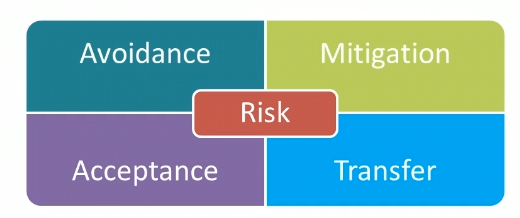
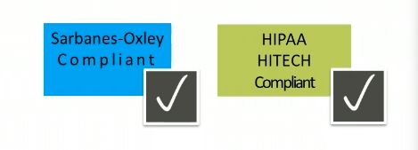
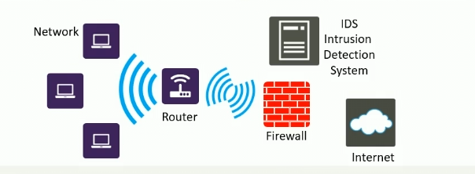
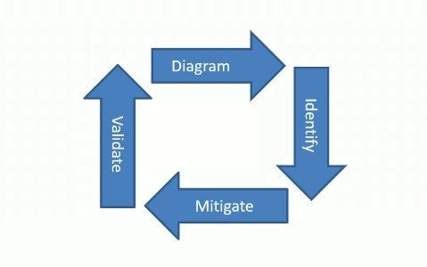
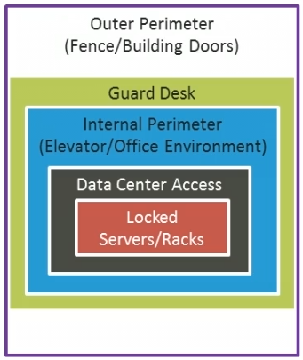

# Security Fundamentals: Core Security
  
  # Security Fundamentals: Core Security

  * recognize the characteristics of confidentiality
  * recognize the characteristics of integrity
  * recognize the characteristics of availability
  * distinguish risk management strategies
  * recognize the characteristics of the least privilege principle
  * identify techniques for avoiding social engineering
  * distinguish between the different components of attack surfaces
  * describe the use of the new threat modeling tool
  * identify characteristics of site security
  * distinguish between the equipment used for securing computers
  * identify the security challenges of removable devices and drives
  * distinguish between the different technologies for securing mobile devices
  * identify characteristics of keyloggers

### The CIA triad:
* Confidentiality
* Integrity
* Availability
#### Confidentiality as relates to data/information security:
* Mitigating unauthorized accsess to sensitive network assets
#### Accompished though vrious levels of: 
* Encryption
* Authentication
* Access controls
#### Confidentiality classifications
Common confidentially classifications - as exsemple:
* Public
* Internal
* Condfidential
Governmental agencies:
* Unclassified
* Restricted
* Secret
* Nop secret

#### The Core Concept of Integrity
Integrity as it relates to data/information security:
* To protect data/information against unauthorized of accidental change
Encomprasses data/information
* Consistency
* Accuracy
* Validity
Data/information integrity accopmpished throught:
* Security programs which manage and detected change
* Permissions control access to assets
* Auditing and accounting processes to record change

#### The Core Conceprt of Availability:
Availability as relates to datd/information security
* the generally unfettered accessibility of recourses to users, systens and/or applications as required

#### Treats to Data/Information availability
Two commons threats to data/infomation availability: 
- Natural disasters
- Equipment failure
- Unplanned outages
Deliberate:
- DoS attacks
- Network worms

#### The Impact of Threats and Risks
Risk managment:
- Identyfying. assessing and ptioritizing threats and risks wit focus on negative risks
Risk:
- The likelyhood of an event occuring
Threat:
- A specific risk that could result in an unwatched breach by exploiting system vulnerabilities

#### The purpose of a risk managment plan:
- Remove risk where possible
- Mitigate consequences of those risks which can't be prevented
The steps of a risk management plan:
- Perform a risk assessment
- - Identify risks may harm your environment
- Evaluete risks against two factors:
- - The likelihood the risks will occur
- - What impact the risks will have on your environment
- Prioritize identified risks:
- - Utilize a risk matrix to assist in risk ranking
- - Outline risk ranking/risk score

#### Risk Managment Plan Detalied - Risk Response
Respond to risks using typical methods:
- Avoidance
- Mitigation
- Accertance
- Transfer

#### Risk Managment Plan Detalied - Avoidance and Mitigation
Risk avoidance:
- Risk is removed by choocing to not participate in an event or activity
Risk Mitigation:
- Risk is minimized throught interventions which lower likelihood and/or impact of the risk
Risk Accetace:
- Knowing the risk and accepting the likelihood and/or impact of the risk
Risk Transfer:
- Shifting risk responsibility to a third perty

#### Residual Risk
Important to be of any residual risk:
- What remains subsequent to implementing measures to lessen likelihood or impact of a negative incidient

#### Principle Of Least Privilege
A securirty measure than can apply to user, sysytem, program or process that defines the least amount of "rigts", or access, required to effectively accomplish its function.
 

#### Principle Of Least Privilege Chalanges:
- Has been around for a long time
- Organizations have driven organizations to focus on its implementation and ensure principle is folowed
- - Sarbanes-Oxley
- - HIPAA
- - HITECH
 
Difficultes lie within the diversity corporate work enviropments:
- Hundred thousands of users
- Dispersed over numerous geographical locations
- Require access to multiple application, file server and printers
- Access requirements may very by location. user type and department security levels
- Application and systam permitions also hve to bee taken into account
- Regulatory requirment auditing to ensuresuccesful implementation akros the enterprise
Use grouprs:
- Ensure user and applications are effectively placed into groups streamline permissions assignment
Use accounts as intended
- Ensure administrators only use admin accounts for admin tasks
Standardize accounts
- Define a number of account types based on user roles and assign as appropriate
Third-party applications:
- There are third-party apps available to help streamline and assist in permissions managment
Processes and procedures:
- Establish a framework for acount managment which defines creation, attributes, assignment and maintenance of all accounts

#### Social engineering:
- A malicious practice, or attack, through which deception in used to again to gain access to network, system or data
- Attecers will attempt to gain personal/sensitive information from trusting individuals to furter their exploits
- The attack can occur by various means:
- - Through email
- - Over the phone
- - In person

#### Avoiding Social Engineering
Techiques to help avoid social engineering attacks:
- Be distrustful:
  - Any communication through which requests are made for sensitive internal information should be met whit suspicion
  - Report such occurrences to the appropriate personnel
Exercise caution:
- Sensitive infirmation should not be provided to anione that does not have a right to that information
Techniques to help aviod social engineering attacks continued:
- Confirm identifty
  - Ensure to validate the identity of all unknown requestors of sensitive internal information - request:
    * Name(s)
    * Phone number(s)
    * Photo ID(s)
  - Avoid email
    * Personal, sensitive, internak information shoulddn't be conveyed via email requests 
    * Be wary of embedded links email messages

#### Attack Surface Analysis
Attack surface
- Entry point an attacker uses to breach a system
- Network or application foe malicious intent(преступное намерение)
Three areas are examined in order to determine the attack surface of an environment
- Application
- Network
- Employee
Considerations when assessing the application attack surface:
- How much code an application has
- How many data inputs there are in the application
- How many and what type of service and running
- Listening ports the application uses

##### Network attack Surface
Consideration when assessing the nwtwork attack surface:
- Network design
- Location of critical systems
- Lokation and configuration of firewalls
- Configurations and aspects security related devises - IDS, VPN
 
##### Employee Attack surface
Considaration when assesing the employee attack surface:
- What is the likelihood of your environment experting occurrences of
- Social engineering
- Malicious behavior
- Human error
- 
Download Attack Surface Analyzer
- Trustworthy Computing Group
- MSFT Internal Use
- Snapshot system state before and after installation
- Displays changes'to key elements of the windows attack surface

### Threat Moddeling
1. Diagram
2. Identify
3. Mitigate
4. Validate

Donwload the Threat Modeling Tool
- Create model
- Use templates
- Build the Model
- Analyze Threaths
- Create Report

### Phisical Site security
Control over who accesses your physical environment, assets and data is important
Security measures to consider are:
- Badge rearers
- Keyboard for access to sensitive areas
- Office and desk keys
- Guards to control access
- Logbooks to record peoples entry 

##### Phisical Site security - Cost
Ensure to cinsider cost when determining your security plan:
- Evaluate the importance of the data/resourses you're protecting and commersurately acquire security resourses
Ensure youre security measures aren't averly cumbersome:
- Inplement proper training
- If security measures are too ardouous, users may br tamped to circumvent them
  
##### Phisical Site security - Access control
Access control:
- In the contex of physical site security, involves the restriction of access to resourses to only those who require access
- Through use of fenses, guards, door locks, etc.

Securing the physical premises:
- Incorporate defense in depth - layered site security:
- Multiple lyers of security to pritect and defend sensitive site assets
- If outher layers are breached, inner layers remaine to thwart attackers from accessing sensitive areas
  
##### Phisical Site security - Physical Premises
The Physical Premises is often divided into three zones:
External perimeter:
- Outermost portion of the physical premises
- Driveways, parking lost, etc.
Internal perimeter:
- Buildings on the physical premises, or only those buildings you occuppy there be multiple tenants
Secure areas:
- Sensitive locations within the building(s) such network rooms, data centersm wiring closets etc.

### Phisical Site security - External Perimmeter
Your external perimeter is the first line of defense which, depending on your environmemtm can be comprised of:
- Security cameras:
  - Concern - can be costly, so balance monitoring casts vs recording schedules
- Lighting
- Fencing
- Gates
- Guards
  
### Phisical Site security - Internal Perimmeter
Your internal security consist of exterior doors. walls and any internal secure areas, such as:
- External/internal doorlocks
- Keypads
- Card readers 
- Concierges
- Smoke detectors
Implement the principle of least privilege from a physical perspective, by segregating your internal space appropriately

### Phisical Site security - Security Areas
Your secure areas consist of the most sensitive rooms or locations within your environment's internal perimeter - network rooms and writing closets, stc.
Any secure area where srtict security control is required in order to minimize unauthorized access from ethter external attackers or unwarranted internal employee access.
Access limited throught the yse of:
- Security doors. keypads, card readers, biometric systems, cameras and intrusion detection systems.

### Phisical Site security - Site Sucurity Processes
You should also implement site security processes for each area which define:
- External Perimeter:
  - Parking lot access management, Guard patrol schedule, Tracking entries and exist, Dealing with abandoned packages and suspicious pepole
- Internal perimeter:
  - Sign-in procedures, door locking schedules, delivery processes escorting visitors, personal equipment entry and removal procedures
- Secure Areas:
  - Will generally have strict procedures in place. such as who allowed to enter and when
  
### Computer Security
Computer security generally refers to securing physical computers, which typically are:
- Servers - back-end machines which host centralized applications and servises - domaine controller, email server, web server, etc.
- Desktops - front-end machines typically utilized by end users to interact with back-and services.
- Mobile computers - laptops. notebooks, netbooks, tablets and smartphones. Function similary to a desktop with the added flexibility of mobility.

##### Computer Security - Servers
Considerations for physical server security:
- Servers are expensive, provide critical servises and applications
- Should be lockated in a data center of computer room
- Or at the very least, locked whit a security cable, or in a security cabinet or rsck with a locking door.

##### Computer Security - Desktop
Consideratoins for physical desktop security:
- Desktops are generally inexpensive
- Typically used in secure offices or at home
- Computer security cables are typically sufficient

### Removoble Devices
Removoble devices can be in the format of:
- MicroSD/SD cards
- Thumb/flash drivers
- External drivers
- Floppy disks/CDs/DVDs
They generally connect to a computer via USB ports/readers or Firewire ports
  
##### Removoble Devices and Drivers - Security Challenges
There are numerous security challenges with these items, primary:
- Loss- the most common issue, especially whit USB drivers
  - If possible, recommended to implement authetification/encryption
  - Raise awareness as to the risks of data stored something so easily misplased
- Thetf - convenience of portability also makes such item easy to steal
  - Keep items with you, or locked in a secure location
  - Devices are cheap, but data be confidential and irreplaceable
- Espionage - the best measure is to protect data from unauthorized access and employee the principle of least privilege
  
### Mobile Device Security  
Mobile devces such a laptops, PDAs and smartphones, represent one of the most difficult security challenges for your organization
They can store large amounts of sensitive data, which if lost or stolen, can have an immeasurable impact on your organization

##### Mobile Device Security - Laptops
Options for securing laptops include:
- Alarms
  - Motion sensitive - alert when device is moved
- Security Cables
  - Allows for anchoring to a secure object
- Safes
  - Virtually impenetrable and can secured to an immovable object
- Docking Stations
  - Many models contain some combination of key/padlock depending on model
- Thetf recovery software
  - Allows for traking should the device be stolen

##### Mobile Device Security - PDAs And Smartphones
These devices can be more dificult to secure than laptops. Some recommendations are:
- Employ passwords and encryption
- Utilize remove wiping applicattions and GPS measures for tracking
- Always keep your mobile device with you, or within sight
- Don't leave device unattended in a vehicle
- When traveling, use a hotel safe if available

### Keyloggers
Define Keyloggers:
- A device than capture keystroke input. Can be either:
  - Logical - covertly installed application
  - Physical - device placed between keyboard and computer(There are also wireless sniffers than can be used to capture wireles keyboard input)
Either option will capture user keyboard iput repayed in order to procure sensitive information:
- Passwords
- Credit card numbers
- User IDs
##### Keylogger Defense
Physical keylogger defense:
- Visual inspection - an extra device between the computer an keyboard could be a keylogger
- Important to check when using a shared or public computer
Logical keykogerdafense:
- Ensure antimalware software is up to date
- User Account can help ensure no unauthorized software is installed
Wireless sniffer defense:
- Utilize a wireless keyboard which supports encription
